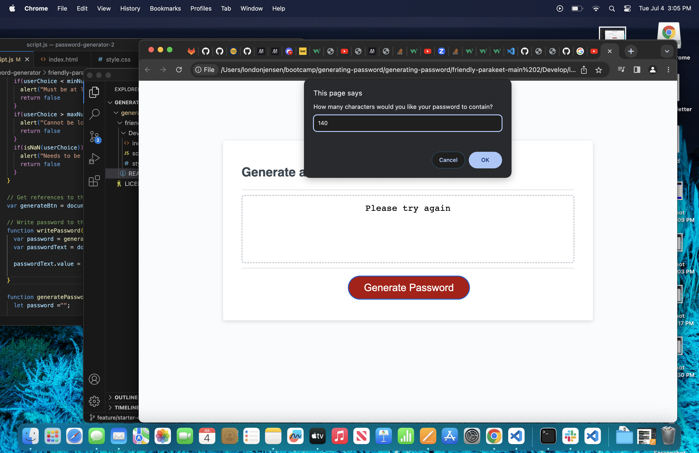
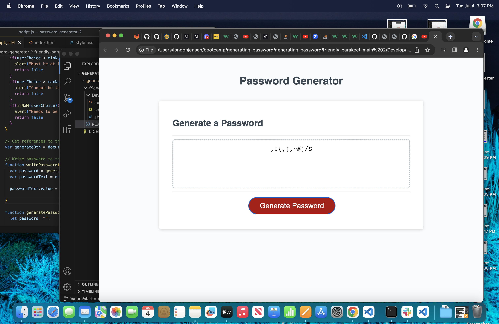

# Password Generator

## Description

- My motication for this project was to learn how to use JavaScript effectively, so I could build a password generator. This project requires many JavaScript skills. These skills are things I  wanted to improve on, and learn how to use effectively.
- I built this project so users could have a password generated for them by inputing their preferences. 
- This gives users a password that is safe to use, and that will keep other people from hacking their accounts. This allows the user to choose the length and what characters they want to include in their password. 
- During this project I learned how to use array's, strings, for loops, if/else statements, console.logs, constants, and JavaScript functions.

## Usage

- When users click the 'Generate Password' button. The first prompt will appear. It asks the user 'How many characters would you like your password to contain?'. They must enter a valid number that is no less than 8 characters long and no more than 128 characters long.
- If the user does not meet the length requirement an alert will notify them. If they enter a number less than 8, the alert will read 'Must be at least 8 characters long.' If they enter a number higher than 128 the alert will read 'Cannot be longer than 128 characters.'
- The user will need to confirm this by clicking 'OK'. They will then need to click the 'Generate Password' button again.
- In the box it will say "Please try again".
- If the user tries to type in for example 'cat' into the userChoice box it will alert them "Needs to be a number", and in the box state "Please try again".
- They will be prompted again to enter the length of their password.
- Once the user has entered a valid length they will see the follow up prompt that says "Click 'OK' to confirm including special characters". If the user would like to include special characters in their password they will click 'OK', or 'Cancel' if they don't want to include them.
- The next prompt will ask 'Click 'OK' to confirm including numeric characters'. If the user would like to include numbers in their password they will click 'OK', or 'Cancel' if they don't want to include them.
- Followed by, 'Click 'OK' to confirm including lowercase characters'. If the user would like to include lower case letters in their password they will click 'OK', or 'Cancel' if they don't want to include them.
- Lastly, 'Click 'OK' to confirm including uppercase characters'. If the user would like to include upper case letters in their password they will click 'OK', or 'Cancel' if they don't want to include them.
- Inside of the box the user will be presented with a password that meets all of the requirements they input.

## License

MIT license

## Deployment

The application is not deployed at live URL.
The application is loading with errors.
I am going to office hours to ask why it is not loading properly from my GitHub pages.

[link](https://lonj214.github.io/generating-password/)

## Screenshots

